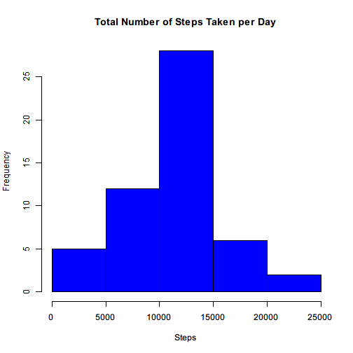
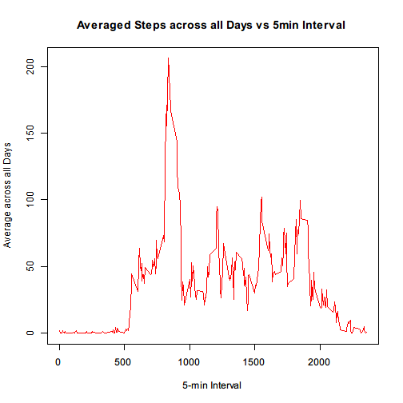
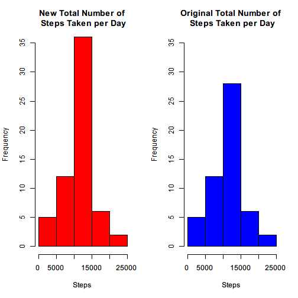
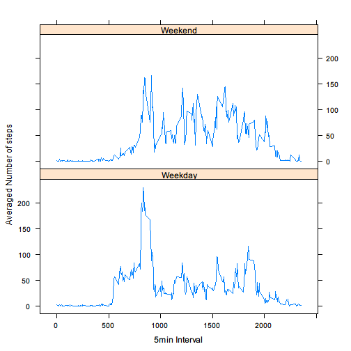

# Reproducible Research Assingment 1

## Loading and preprocessing the data

* Please download the zipped file and put into current working directory with the default name "activity.zip"


```r
# unzip and read the csv file to a data frame
# assuming "activity.csv" is in the working diretory
unzip("activity.zip")
activity_data<- read.csv("activity.csv")
```

* Check the content of the data frame


```r
str(activity_data)
```

```
## 'data.frame':	17568 obs. of  3 variables:
##  $ steps   : int  NA NA NA NA NA NA NA NA NA NA ...
##  $ date    : Factor w/ 61 levels "2012-10-01","2012-10-02",..: 1 1 1 1 1 1 1 1 1 1 ...
##  $ interval: int  0 5 10 15 20 25 30 35 40 45 ...
```

## What is mean total number of steps taken per day?

* Calculate the total number of steps taken per day


```r
tot_steps_day <- aggregate(steps ~ date, activity_data, FUN = "sum", na.rm = TRUE)
```

* Plot as histogram


```r
hist(tot_steps_day$steps, col = "blue", xlab = "Steps", 
     main = "Total Number of Steps Taken per Day")
```



* Calculate and report the mean and median of the total number of steps taken per day

Mean of the total number of steps taken per day


```r
mean(tot_steps_day$steps, na.rm = TRUE)
```

```
## [1] 10766.19
```

Median of the total number of steps taken per day


```r
median(tot_steps_day$steps, na.rm = TRUE)
```

```
## [1] 10765
```

## What is the average daily activity pattern?

* Calculate the mean number of steps by interval for all days


```r
mean_steps_interval <- aggregate(steps ~ interval, activity_data, FUN = "mean", na.rm = TRUE)
```

* Make a time series plot (i.e. type = "l") of the 5-minute interval (x-axis) and the average number of steps taken, averaged across all days (y-axis)


```r
plot(y = mean_steps_interval$steps, x = mean_steps_interval$interval, 
     xlab = "5-min Interval", ylab = "Average across all Days", main = 
     "Averaged Steps across all Days vs 5min Interval", col = "red" , 
     type = "l")
```



* Which 5-minute interval, on average across all the days in the dataset, contains the maximum number of steps?


```r
mean_steps_interval[mean_steps_interval$steps ==
                    max(mean_steps_interval$steps),"interval"]
```

```
## [1] 835
```

## Imputing missing values

* Calculate and report the total number of missing values in the dataset (i.e. the total number of rows with NAs)


```r
sum(is.na(activity_data))
```

```
## [1] 2304
```

* Devise a strategy for filling in all of the missing values in the dataset. The strategy does not need to be sophisticated. For example, you could use the mean/median for that day, or the mean for that 5-minute interval, etc.

Mean for the 5-minute interval will be used to fill the missing values since it has been calculated in dataset "mean_steps_interval"

* Create a new dataset "new_data" that is equal to the original dataset but with the missing data filled in


```r
new_data <- activity_data 
for (i in 1:nrow(new_data)) {
    if (is.na(new_data$steps[i])) {
        new_data$steps[i] <- mean_steps_interval[which(new_data$interval[i]
        == mean_steps_interval$interval), ]$steps
    }
}
```

check and compare the new dataset "new_data" to the original dataset "activity_data"


```r
str(activity_data)
```

```
## 'data.frame':	17568 obs. of  3 variables:
##  $ steps   : int  NA NA NA NA NA NA NA NA NA NA ...
##  $ date    : Factor w/ 61 levels "2012-10-01","2012-10-02",..: 1 1 1 1 1 1 1 1 1 1 ...
##  $ interval: int  0 5 10 15 20 25 30 35 40 45 ...
```

```r
str(new_data)
```

```
## 'data.frame':	17568 obs. of  3 variables:
##  $ steps   : num  1.717 0.3396 0.1321 0.1509 0.0755 ...
##  $ date    : Factor w/ 61 levels "2012-10-01","2012-10-02",..: 1 1 1 1 1 1 1 1 1 1 ...
##  $ interval: int  0 5 10 15 20 25 30 35 40 45 ...
```

```r
sum(is.na(new_data)) # number of "NA"s in the new dataset
```

```
## [1] 0
```

* Make a histogram of the total number of steps taken each day and Calculate and report the mean and median total number of steps taken per day. Do these values differ from the estimates from the first part of the assignment? What is the impact of imputing missing data on the estimates of the total daily number of steps?


```r
new_tot_steps_day <- aggregate(steps ~ date, new_data, FUN = "sum", na.rm = TRUE)

par(mfrow = c(1, 2))
hist(new_tot_steps_day$steps, col = "red", xlab = "Steps", ylim = c(0, 35),
     main = "New Total Number of\n Steps Taken per Day")
hist(tot_steps_day$steps, col = "blue", xlab = "Steps", ylim = c(0, 35),
     main = "Original Total Number of\n Steps Taken per Day")
```



Mean of the new total number of steps taken per day (original is 10766.19)


```r
mean(new_tot_steps_day$steps, na.rm = TRUE)
```

```
## [1] 10766.19
```

Median of the new total number of steps taken per day (original is 10765)


```r
median(new_tot_steps_day$steps, na.rm = TRUE)
```

```
## [1] 10766.19
```

## Are there differences in activity patterns between weekdays and weekends?

Use the dataset with the filled-in missing values for this part.

* Create a new factor variable "week" in the dataset with two levels - "weekday" and "weekend" indicating whether a given date is a weekday or weekend day.


```r
day <- factor(weekdays(as.Date(new_data$date)))
new_data$day <- day
new_data$week <- factor(ifelse (new_data$day %in% c("Saturday", "Sunday"), 
                         "Weekend", "Weekday"))
```

Check the new_data for the "week" column as a weekday or weekend day factor


```r
str(new_data)
```

```
## 'data.frame':	17568 obs. of  5 variables:
##  $ steps   : num  1.717 0.3396 0.1321 0.1509 0.0755 ...
##  $ date    : Factor w/ 61 levels "2012-10-01","2012-10-02",..: 1 1 1 1 1 1 1 1 1 1 ...
##  $ interval: int  0 5 10 15 20 25 30 35 40 45 ...
##  $ day     : Factor w/ 7 levels "Friday","Monday",..: 2 2 2 2 2 2 2 2 2 2 ...
##  $ week    : Factor w/ 2 levels "Weekday","Weekend": 1 1 1 1 1 1 1 1 1 1 ...
```


* Make a panel plot containing a time series plot (i.e. type = "l") of the 5-minute interval (x-axis) and the average number of steps taken, averaged across all weekday days or weekend days (y-axis). See the README file in the GitHub repository to see an example of what this plot should look like using simulated data.


```r
library(lattice)

steps_interval <- aggregate(steps ~ interval + week, new_data, mean)

xyplot(steps ~ interval | week, steps_interval, type = "l", layout 
       = c(1, 2), xlab = "5min Interval", ylab = "Averaged Number of steps")
```




